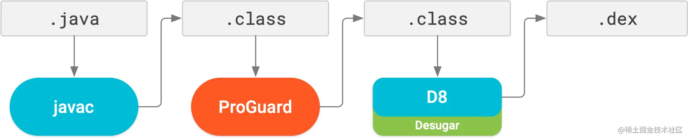
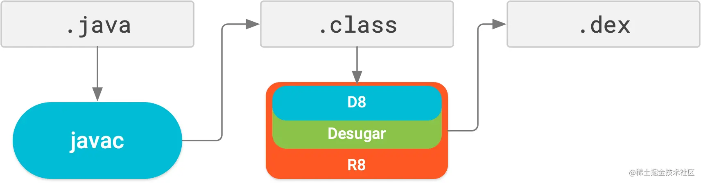

# 文章连接
&emsp;&emsp;[Android Apk 编译打包流程，了解一下~](https://juejin.cn/post/7113713363900694565)

# 1. 流程

>1. 使用AAPT 将resource文件生成对应的R.java。同时还会进行资源压缩。
>2. 使用aidl 工具 aidl文件转成Java文件。
>3. 使用javac 工具对应的Java代码转成class文件，kotlin 使用KotlinC。
>4. 使用D8 和 R8等工具将class 文件转成 dex文件。
>6. 使用apk打包工具，将dex文件以及相关的资源文件打包成为apk.
>7. 使用 zipsigner 或者Jarsigner对应Apk进行签名。
>8. 签名完成，需要zipalign工具进行4字节对齐。

# 2. D8 和 R8的区别
>1. D8：将class文件转换成为dex文件。
>2. R8：是代替传统的Proguard，用于代码压缩和混淆。

&emsp;&emsp;改变之前：

&emsp;&emsp;改变之后：

