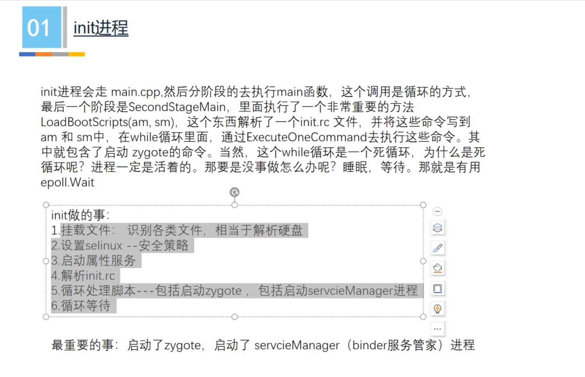
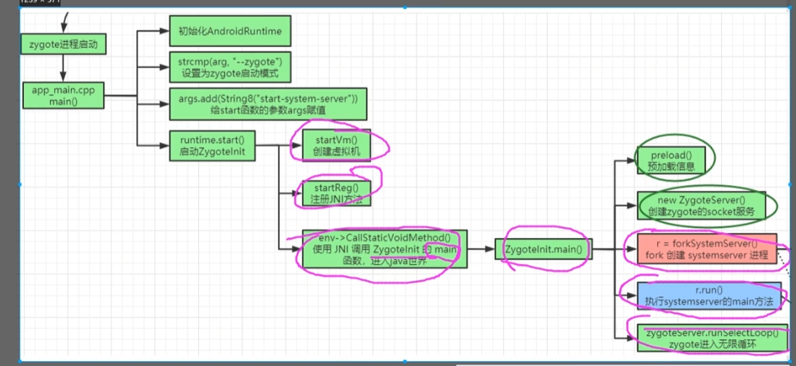

# 1.概览
Binder是以C/S架构模式进行通信，一般来说，客户端会有一个服务端的Binder对象，通过Binder对象跟服务端进行通信。

# 2.ServiceManager
ServericManager是所有Binder的对象的管家，所有进程的Binder都需要发布到ServiceManager. ServiceManager是一个独立的进程，是在init进程里面初始化init.rc文件，启动的。

# 3. Zygote进程
Zygote进程也是通过Init 进程初始化init.rc文件启动。Zygote启动的流程图：

其中preload阶段，是用来加载很多系统资源，例如字体资源，以及相关的类。

# 4. SyatemSever进程
SystemServer进程是由Zygote进程启动的。SystemServer启动之后，会启动很多的服务，例如AMS，ATMS，这些服务都由SystemServiceManager来启动且管理。
服务启动之后，会把服务对应的Binder对象发布到ServiceManager，所以其他进程想要跟AMS通信，首先需要跟ServiceManager通信，拿到对应的Service的Binder，才能通信。

# 5. App进程
App进程是由Zygote进程fork出来，且启动的。在启动的时候，会通过zygoteInit操作，启动一个该进程的Binder驱动。之后，到Java层会执行ActivityThread的main方法，此时会在attach阶段把进程的Binder对象发布到ServiceManager。

# 6. Binder是如何通信？
首先，Binder驱动的启动是在该进程启动之初进行的，是由zygoteInit去做，Binder驱动本质上是Linux上的一个文件，名为/dev/binder。

进程A需要跟进程B通信，需要拿到进程B的Binder对象(这个对象是一个代理对象)，这个对象就从ServiceManager里面去获取。当拿到Binder对象之后，会使用这个Binder对象传输。其中客户端进程是用Proxy对象进行通信，而服务端进程是用Stub对象去收到信号。

# 7. Binder是如何保证拷贝一次？
当客户端进程将对应的数据写入Binder中的时候，Binder最终会把这部分的数据写到内核的共享内存区分，这个共享内存区域就是服务端的/dev/Binder文件(即Binder驱动)，而服务端进程通过mmap操作将Binder驱动区域映射到内存当中，映射之后，操作这块区域的数据犹如操作内存。
由于只发生了从客户端进程到Binder驱动的内存拷贝，所以只拷贝了一次。

# 8. SystemServer进程跟Zygote通信，为啥不用Binder，而用Socket？
这是因为Binder是一个线程池。多线程的场景下，存在锁竞争，而fork进程是一个复制的过程，如果原有的Binder线程有等待锁的情况，fork出来新进程之后，也有对应的等待锁。但是在新进程，可能不能成功解锁，所以会死锁。
