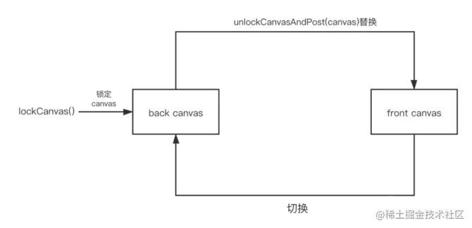
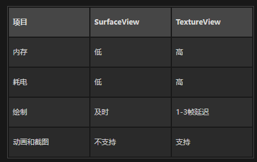

# 1. SurfaceView
SurfaceView是拥有一个独立Surface和独立渲染线程，所以用于独立的绘制。SurfaceView虽然是View，但是它本身不属于View树，所以相关的View动画做不了。
Surface是本身双缓冲机制，双缓冲是指由两个画布，一个用来绘制和显示当前画面，一个用来存储临时的画面信息。


系统有一个图形合成服务，叫做SurfaceFlinger，它的职责将应用程序的所有Surface缓冲区合并成为屏幕中的图像。

为了解决View动画的一些问题，SurfaceView提供了一个子类，叫做GLSurfaceView。

# 2. TextureView
TextureView是继承于View，它本身支持View相关属性，同时在5.0之前，它是在UI线程进行渲染，但是5.0之后，有一个独立线程进行渲染。TexttureView仅支持硬件加速。

# 3. SurfaceView和TextureView的优缺点对比



# 4. 硬件加速
Android 硬件加速是一种通过利用设备的硬件资源来提高应用程序绘图、动画和图形渲染性能的技术。例如，使用GPU 来加速图形渲染。
打开硬件加速的办法：
```
android:hardwareAccelerated="true"
```
或者：
```
// 启用硬件加速
view.setLayerType(View.LAYER_TYPE_HARDWARE, null);

// 禁用硬件加速
view.setLayerType(View.LAYER_TYPE_SOFTWARE, null);
```